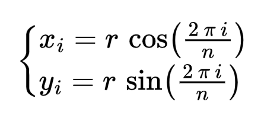

# sofar-printer-simulator
Second assignment of the SOFAR course. It builds on top of the first assignment to implement a simple 2D simulator of a robotic printer, capable of drawing geometric shapes. Implementation is done through ROS2/Python, with the help of the Arcade library.

## Dependencies

The project targets ROS2 distributions. It has been successfully tested with Galactic and Humble distros (desktop installation).

The only external depencency needed is Arcade library (see [Instructions for Linux install](https://api.arcade.academy/en/latest/install/linux.html))

## Execution

Clone the repository in your workspace and compile as usual.

Run the simulation node with the command:

```ros2 launch sofar_printer_simulator printer_sim.launch.py```

## Assignment


You need to implement the following architecture, made up of 5 nodes:

1) The **printer sim node** is already provided with this repository and acts as the simulator of the robotic printer, exposing all the necessary interfaces.
    1. *Subscribed Topics*
       1) **/draw** boolean value which can be set to true or false to activate/deactivate drawing mode
       2) **/next_waypoint** stores the (x,y) coordinates of the next polygon vertex, expressed with respect to the end-effector (that is, considering the end-effector as origin)
       3) **/motor_x** stores the updated X component of the end-effector's position, resulting from the control loop
       4) **/motor_y** stores the updated Y component of the end-effector's position, resulting from the control loop
    2. *Published Topic*
       1) **/controller_setpoint** stores the (x,y) target coordinates for the end-effector, expressed in the global reference frame. A new setpoint is automatically published by the simulation upon receiving the corresponding message on **/next_waypoint**, thus performing implicit conversion from end-effector coordinates to global ones, which are needed by the controllers.
    3. *Exposed Service*
       1) **/end_effector_position** since end-effector does not start from the top-left corner (which is considered the origin in the global frame), this service allows retrieving the (x,y) initial coordinates of the end-effector to properly initialize the controllers' internal variables.

2) The **controller nodes**, which work exactly like in the previous assignment, that is, implement a simple PID control loop to drive respectively the X and Y component of the end-effector's position. This time, however, the end-effector starts from a position which is not (0,0), therefore the two nodes need to properly initialize their position by invoking the **/end_effector_position** service exposed by the simulator.

3) The **robot logic node**, which acts has *high-level controller*, invoking the **shape service node** to retrieve the vertices of the regular polygon based on input parameters (*radius* and *number of vertices*). The parameters are expected to be properly defined and initialize inside the node and later passed from the launch file. Upon receiving the list of vertices from the **shape service node**, **robot logic node** will enable drawing mode through the **/draw** topic and will start publishing vertices one by one on the **/next_waypoint** topic, which in turn will trigger the control sequence. A new vertex waypoint is published whenever the controllers signal their idle state via the **/ack_x** and **/ack_y** topics. upon completing the vertices, the node will disable drawing mode and terminate.

4) The **shape service node** implements a simple service for computing the vertices of a regular polygon given *radius* and *number of vertices* as request parameters, according to the following equation:



sada

### Important Notes

**BEWARE: it is mandatory to rename your package before submission on AulaWeb (make sure to change the package name in the *setup.py*, *package.xml*, under the *resource* folder and in the *setup.cfg*) according to the following template &rarr;** *&lt;surname&gt;_&lt;matricola&gt;_assignment3* 

**BEWARE2: It is mandatory to launch the full simulation using the provided launch file. Submissions not including a launch file to open up all nodes together will not be evaluated!!!**

Good luck ;)

## Expected Output


## Troubleshooting

As of ROS2 Humble, there is a weird bug which prevents the application from being launched correctly unless the ```import arcade``` statement is placed as first. Whatever changes you do in the code, make sure to always keep that import as first line of code.
