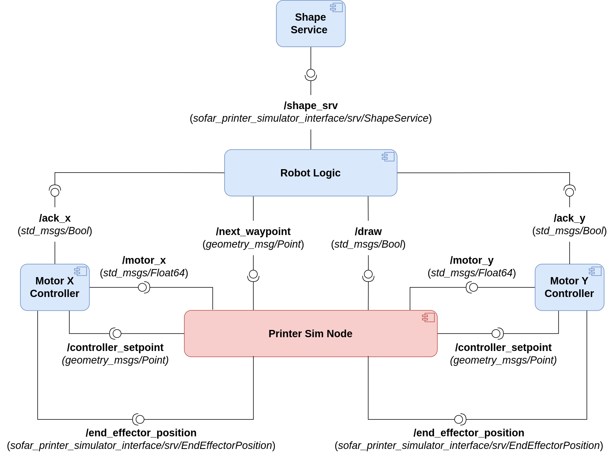

# sofar-printer-simulator
Second assignment of the SOFAR course. It builds on top of the first assignment to implement a simple 2D simulator of a robotic printer, capable of drawing geometric shapes. Implementation is done through ROS2/Python, with the help of the Arcade library.

## Dependencies

The project targets ROS2 distributions. It has been successfully tested with Galactic and Humble distros (desktop installation).

The only external depencency needed is Arcade library (see [Instructions for Linux install](https://api.arcade.academy/en/latest/install/linux.html))

## Execution

Clone the repository in your workspace and compile as usual.

Run the simulation node with the command:

```ros2 launch sofar_printer_simulator printer_sim.launch.py```

## Assignment

You need to implement the following architecture, made up of 5 nodes:
1) The **printer_sim_node** is already provided with this repository and acts as the simulator of the robotic printer, exposing all the necessary interfaces:
  1. aAAa
  2. aAaa
3) The **controller nodes**, which implement a simple PID controller to control, respectively, the horizontal and vertical motor of the crane. Feel free to implement your own controller or use available ones (e.g., [simple-pid-python](https://pypi.org/project/simple-pid/)).
The controllers receive the target position on the **/controller_setpoint** topic and activate the control loop to drive the crane's end-effector, publishing the corresponding updated position on their respective topic. Whenever the target position is reached, the control loop stops and the controller publishes an acknowledgment message on the corresponding topic.
3) The **robot logic node**, which acts has *high-level controller*, guiding the crane through the stages of the pick-and-place. The node waits for both controllers to be idle, then publishes the next stage of the pick-and-place on the given topic. 
Each pick-and-place action begins with the PICK stage (thus you will need to publish a **std_msgs/Int64** message with the data field set to 1) and concludes with the DROP stage, where the current container is delivered and a new one will spawn inside the simulation, increasing your overall score.



### Important Notes

**BEWARE: it is mandatory to rename your package before submission on AulaWeb (make sure to change the package name in the *setup.py*, *package.xml*, under the *resource* folder and in the *setup.cfg*) according to the following template &rarr;** *&lt;surname&gt;_&lt;matricola&gt;_assignment3* 

**BEWARE2: It is mandatory to launch the full simulation using the provided launch file. Submissions not including a launch file to open up all nodes together will not be evaluated!!!**

Good luck ;)

## Expected Output


## Troubleshooting

As of ROS2 Humble, there is a weird bug which prevents the application from being launched correctly unless the ```import arcade``` statement is placed as first. Whatever changes you do in the code, make sure to always keep that import as first line of code.
